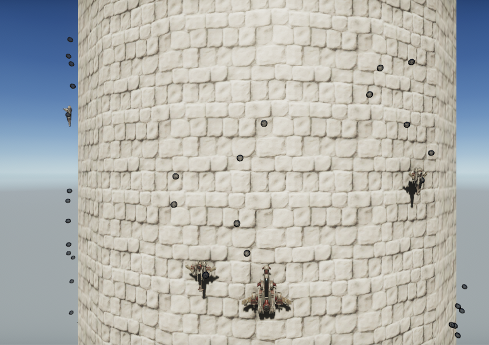

# Towering light

> Concept of a shoot 'em up game which plays around a pillar

---
This repository includes: 
- enemies movement and pattern creation
- player movement
- enemies and player firing (no damage for the player)

The goal of this repository is to show an idea of gameplay with efficient code for multiple patterns of movements for enemies 
